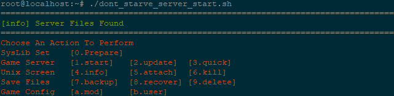

# Do Not Starve Together Server Shell

This repository contains the bash code for:
* Klei Don't Starve Together server configuration on ubuntu

# Features
- Prepare for dontstarve_dedicated_server_nullrenderer

```bash
# ----- libs need by dontstarve_dedicated_server_nullrenderer -----
sudo apt install lib32stdc++6
sudo apt install libcurl4-gnutls-dev:i386
sudo apt install libgcc1
sudo apt install libstdc++6
```

- Check and install steamcmd & Steam/.../Don't Starve Together Dedicated Server
```bash
wget https://steamcdn-a.akamaihd.net/client/installer/steamcmd_linux.tar.gz
tar -xvzf steamcmd_linux.tar.gz
```

- Display action menu

    

- Start the server
   
   * [1.start]
   
   choose map (surface/caves) and cluster_[1~5], then, you need to create a new screen for another map manually

   * [2.update]
   
   when the game update, server have to update along with it

   * [3.quick]
   
   start surface and caves map together. Execute bash cmd 'top' finally 

- Screen quick operations
- Game archive files operations
- Game mod Configurations
- User Management (adminlist/blocklist/whitelist)
